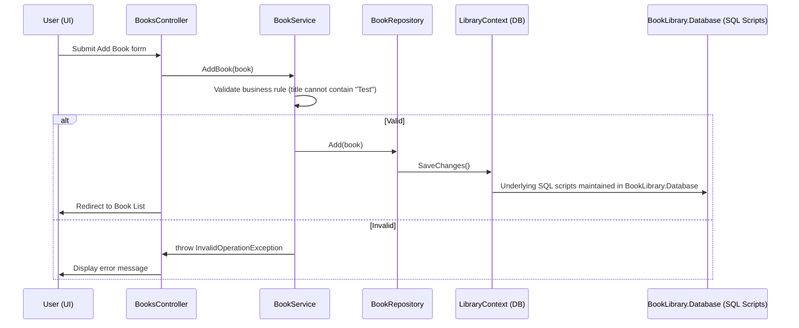

# BookLibrary Demo Project: Architecture Overview & Testing Scope

> This demo project will use in upcomming tutorial series for Unit Testing, TDT and UI testing. 
---

## 1. Architecture Overview

A simple ASP.NET MVC (.NET Framework 4.8) application for managing a library of books. This project demonstrates clean layered architecture, separation of concerns, dependency injection, and testability, suitable for BDD (SpecFlow), UI automation (Selenium), xUnit-based unit testing, and database unit testing with tSQLt.

### **Solution Structure**

```
BookLibrary/
├── BookLibrary.Database/    # SQL Server Database Project (with tSQLt for DB unit tests)
├── BookLibrary.Data/        # Data access (EF models, DbContext, Repository)
├── BookLibrary.Business/    # Business logic (Services, business rules)
├── BookLibrary.Web/         # ASP.NET MVC web UI (Controllers, Views)
└── BookLibrary.Tests/       # Test project (xUnit, SpecFlow, Selenium)
```
> The **BookLibrary.Database** project is **for source-controlling your SQL scripts** (tables, procs, initial data, tSQLt tests, migrations), not for database-first modeling. Your application can still use **EF Code-First** or **EF Migrations**.

---

#### **A. Database Layer (`BookLibrary.Database`)**
- **Database Project:** Contains `.sql` files for tables, views, stored procedures, and scripts.
- **Unit Testing with tSQLt:** Contains test classes and test procedures, enabling unit tests at the T-SQL level (e.g., for a `Book` table or a `usp_AddBook` stored procedure).
- **Automated Builds:** Allows you to deploy, version, and test the database independently.

#### **B. Data Layer (`BookLibrary.Data`)**
- **Entities:** Defines `Book` with properties (`Id`, `Title`, `Author`).
- **DbContext:** `LibraryContext` manages EF DB connection and `DbSet<Book>`.
- **Repository Pattern:** `IBookRepository` abstracts data access; `BookRepository` implements CRUD using `LibraryContext`.

#### **C. Business Layer (`BookLibrary.Business`)**
- **Services:** `IBookService` interface and `BookService` implementation.
- **Business Rules:** Encapsulates domain logic, e.g., **book titles cannot contain the word "Test"** (throws exception if violated).
- **Dependency:** Uses `IBookRepository` for data operations.

#### **D. Presentation Layer (`BookLibrary.Web`)**
- **Controllers:** e.g., `BooksController` depends on `IBookService` (not direct data access).
- **Views:** Razor views for listing, creating, editing, deleting books.
- **Error Handling:** Business rule violations are shown as model errors in the UI.

#### **E. Dependency Injection**
- **Unity Container:** Configured in `UnityConfig.cs` (Web project).
    - Maps interfaces to implementations:
        - `IBookRepository` → `BookRepository`
        - `IBookService` → `BookService`
        - Registers `LibraryContext`
- **Controller Construction:** Services injected via constructors, allowing for easy mocking and testing.

#### **F. Testing Layer (`BookLibrary.Tests`)**
- **xUnit:** For unit testing business, repository, and controller layers.
- **SpecFlow:** BDD scenarios for features like "Add Book", "List Books".
- **Selenium:** UI automation for browser-based tests, e.g., verifying business rules in the UI.
- **Database (tSQLt):** Database unit tests live in the database project and can be run independently or as part of a CI/CD pipeline.

---

### **Key Architectural Benefits**

- **Separation of Concerns:** Data access, business logic, and UI are distinct, reducing coupling.
- **Testability:** All dependencies are injected; repositories and services can be mocked.
- **Maintainability:** Business rules are centralized in the business layer.
- **Reusability:** Business logic is decoupled from UI, so it can be reused in other apps (e.g., APIs).
- **Extensibility:** New features or rules can be added to the business layer without affecting other parts of the system.
- **BDD & Automation Ready:** Structure is ideal for SpecFlow (business scenarios) and Selenium (UI tests).
- **Database Script Management:** Ensures all DB schema and logic changes are tracked and testable.

---

### **Example Flow: "Add Book" (with Business Rule)**

1. **User submits 'Add Book' form** in the UI.
2. **BooksController** receives the request, calls `IBookService.AddBook`.
3. **BookService** checks business rules (e.g., title doesn't contain "Test").
    - If invalid, throws exception.
    - If valid, calls `IBookRepository.Add` and `Save`.
4. **BookRepository** persists the book using `LibraryContext`.
5. **If error**, message is displayed in UI; **if success**, user is redirected to book list.



---

## 2. Scope for Unit Test (xUnit), SpecFlow (BDD), and UI Testing

This project is designed so you can demonstrate and teach all major test levels in a modern .NET Framework solution using **xUnit**.

---
### **A. Database Project (BookLibrary.Database)**

- **Purpose:**  
  - Source-control all DDL/DML scripts (tables, procs, data, migrations)
  - Optionally, include tSQLt unit tests for DB logic (e.g., stored procs, constraints)
  - **Not** for database-first modeling—your EF models still drive schema
  
### **B. Unit Testing Scope (xUnit)**

**Where?**  
- `BookLibrary.Tests` project.

**What to Test?**
- **Business Layer:** Test business rules in `BookService` (e.g., prevent "Test" in book title).
- **Repository Layer:** (optional, with in-memory DB or mocking).
- **Controller Logic:** Test controller actions using mocks for `IBookService`.
- **Validation:** Edge cases (nulls, invalid data).

**Why?**
- Fast feedback.
- Pinpoint bugs in isolated units (no DB or UI required).
- Teaches how to use Moq or similar libraries for dependency mocking.
---

### **C. SpecFlow (BDD) Testing Scope**

**Where?**  
- `BookLibrary.Tests` project (with SpecFlow NuGet).

**What to Test?**
- **Business Scenarios:** End-user stories, e.g., "As a librarian, I want to add a book so that it appears in the catalog."
- **Integration:** End-to-end scenarios, e.g., adding a book and verifying it appears in the list.
- **Negative Cases:** Try adding a book with "Test" in title and check for error.

**Why?**
- Closes the gap between requirements and implementation.
- Living documentation for business logic.
- Can drive development (TDD/BDD).

---

### **D. UI (Selenium) Testing Scope**

**Where?**  
- `BookLibrary.Tests` (UI test folder) or a dedicated project like `BookLibrary.UI.Tests`.

**What to Test?**
- **UI Flows:** Add, edit, delete book via the browser.
- **Validation Messages:** Confirm business rules/errors appear in UI.
- **Cross-browser:** Optionally, Chrome, Firefox, Edge, etc.

**Why?**
- Ensures entire stack works together.
- Catches regression and integration bugs.
- Mimics real user behavior.

---

### **E. How the Layers Interact in Testing**

| Test Level     | Layer Under Test      | Dependencies         | Tools/Libraries              |
|----------------|-----------------------|----------------------|------------------------------|
| DB Unit Test   | SQL Schema/Procedures | tSQLt, SQL Server    | tSQLt, SSMS/CI/CD            |
| Unit Test      | Business, Controller  | Mocked Repositories  | xUnit, Moq                   |
| BDD (SpecFlow) | Full Stack            | Real DB/Test DB      | SpecFlow, xUnit              |
| UI Test        | Full Stack + UI       | Real DB, Browser     | Selenium WebDriver, xUnit    |

---


### **F. Teaching Flow Suggestion**

1. **Database Unit Test (tSQLt):**  
   Show how to write and run database unit tests for entities and stored procedures.

2. **Unit Test (xUnit):**  
   Start with business/service layer. Show test isolation using mocks.

3. **SpecFlow (BDD):**  
   Write scenarios in Gherkin, implement step definitions, and show how they connect to real business logic.

4. **UI Test (Selenium + xUnit):**  
   Automate the browser, show how the UI enforces business rules.

5. **Integration:**  
   Show how all tests together provide confidence in the application.
